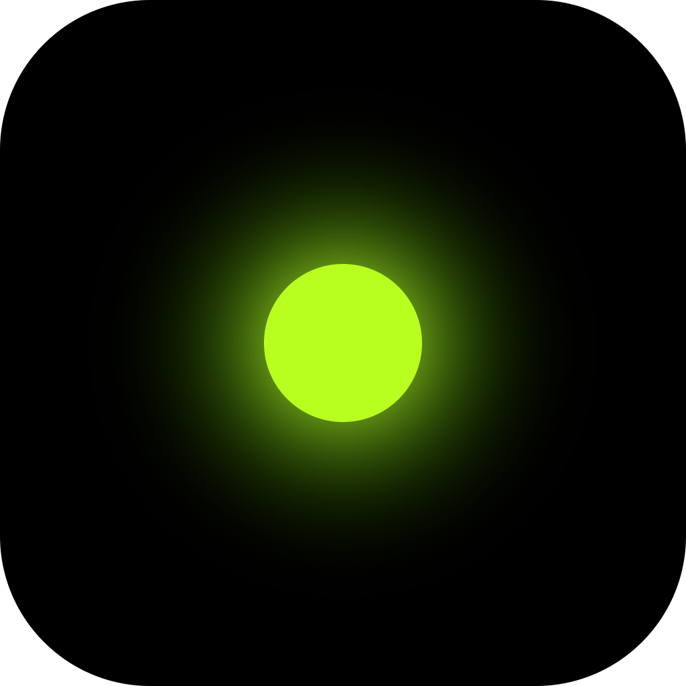
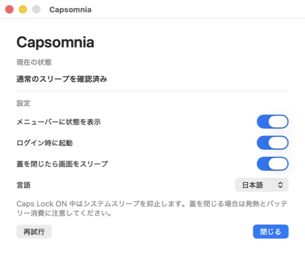
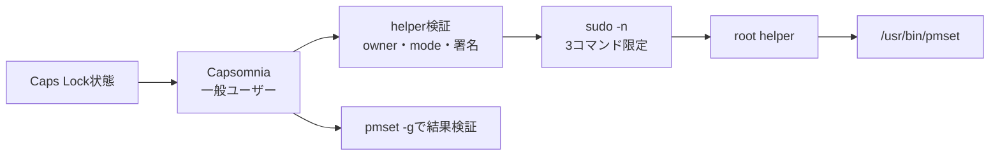

<p align="center">
  
</p>

<h1 align="center">Simple Capsomnia</h1>

<p align="center">
  Caps Lockをスリープ抑止スイッチとして使う、シンプルで監査可能なmacOSメニューバーアプリ。
</p>

<p align="center">
  <a href="https://github.com/Radian0523/simple-capsomnia/actions/workflows/ci.yml"></a>
  
  
  <a href="LICENSE"></a>
</p>

## 概要

Capsomniaは、Caps Lockの状態とmacOSのシステムスリープ設定を同期します。

| Caps Lock | 動作 | 表示 |
|---|---|---|
| ON | システムスリープを抑止 | 緑 |
| OFF | 通常のスリープへ復元 | グレー |
| エラー | 成功扱いせず再試行 | 赤 |

- メニューバーから現在の検証済み状態を確認
- ログイン時の自動起動
- 蓋を閉じたときのディスプレイスリープ
- Codex / Claude Codeの作業中・承認待ち・完了待ちをメニューバーに表示
- 日本語／英語UI
- 終了時に必ず通常スリープへ復元
- ネットワーク通信、テレメトリ、Input Monitoringなし

<p align="center">
  
</p>

> [!WARNING]
> スリープを抑止したままMacBookの蓋を閉じると、発熱やバッテリー消費につながります。
> バッグへ入れる前にCaps LockをOFFにし、`SleepDisabled=0`であることを確認してください。

## 動作の仕組み



アプリは要求した状態と、`pmset -g`で確認できた実際の状態を分けて管理します。helperの実行が
成功しても、実際の値が一致するまでは成功表示にしません。10秒ごとにdriftを検出し、必要なら
再適用します。

## Agent Activity

設定画面の「Codex / Claude Code の状態を表示」をONにすると、各エージェントの公式hookへ
ローカルreporterを登録します。メニューバー左側の点はスリープ状態（緑: 抑止中、グレー: 通常、
赤: 異常）、右側の点はAgent状態（青: 作業中、オレンジ: 承認待ち、赤: 失敗、グレー: 非稼働）を
表示し、メニューからprovider、状態、project名を確認できます。

Capsomniaは状態fileを2秒ごとに確認します。hook実行元のAgentプロセスについてPIDと起動時刻も
照合するため、終了hookが届かない異常終了でも、元のプロセスが終了すれば表示を非稼働へ戻します。
PIDが別のプロセスに再利用された場合も、起動時刻が異なるため同じAgentとは扱いません。

対応範囲:

| エージェント | 対応する実行環境 |
|---|---|
| Codex | デスクトップアプリとCLIのローカルsession |
| Claude Code | CLIとClaude DesktopのCode session |

ブラウザ上のchat、Claude Desktopの通常chat/Cowork、別Mac・SSH先・cloud上だけで動くagentは
ローカルhookを通らないため表示されません。新しいagentへの対応には、そのagentが提供する
lifecycle hookまたはpluginから同じreporter protocolへ変換するadapterが必要です。

保存するのはprovider、project directoryの末尾名、session IDのSHA-256、状態、更新日時、Agentの
PIDとプロセス起動時刻だけです。
prompt、response、tool名、tool input/output、完全なpathは保存せず、外部送信もしません。
状態fileは `~/Library/Application Support/Capsomnia/AgentActivity` にmode `0600`で保存されます。

ソースinstall時から有効にする場合:

```sh
ENABLE_AGENT_ACTIVITY=1 ./scripts/install-local.sh
```

設定は既存内容を残したまま `~/.codex/hooks.json` と `~/.claude/settings.json` へ追加されます。
OFFまたはアンインストール時は、Capsomnia自身のmarkerを持つhookだけを削除します。Codexで
hookの信頼確認が表示された場合は、内容が
`~/Applications/Capsomnia.app/Contents/MacOS/CapsomniaAgentReporter` の実行だけであることを
確認して許可してください。

## 必要環境

- macOS 14 Sonoma以降
- Swift 6 toolchainを含むXcode
- 管理者権限を持つローカルユーザー

このリポジトリはソース配布です。現在、Developer ID署名・公証済みのReleaseバイナリは
提供していません。

## インストール

まずソースと [`docs/PHASE3_INSTALL_PREVIEW.md`](docs/PHASE3_INSTALL_PREVIEW.md) の権限変更を
確認してください。

```sh
git clone https://github.com/Radian0523/simple-capsomnia.git
cd simple-capsomnia
swift test
./scripts/install-local.sh
```

インストール時はmacOS標準の管理者認証ダイアログが表示されます。パスワードをスクリプトへ
渡したり、保存したりしません。

設置されるファイル:

| 種類 | パス |
|---|---|
| アプリ | `~/Applications/Capsomnia.app` |
| LaunchAgent | `~/Library/LaunchAgents/com.github.oonishidaichi.capsomnia.plist` |
| root helper | `/Library/PrivilegedHelperTools/com.github.oonishidaichi.capsomnia.pmset-helper` |
| sudoers | `/etc/sudoers.d/capsomnia_oonishidaichi` |
| agent reporter | `~/Applications/Capsomnia.app/Contents/MacOS/CapsomniaAgentReporter` |

インストール後の検証:

```sh
./scripts/verify-install.sh
./scripts/test-runtime.sh
```

`test-runtime.sh` は一時的にスリープ抑止を有効化し、SIGTERM時の復元、監査ログ、LaunchAgentの
再起動まで確認します。終了時には `SleepDisabled=0` へ戻します。

## アンインストール

```sh
./scripts/uninstall.sh
```

通常スリープを復元してから、Capsomniaが作成したアプリ、LaunchAgent、helper、sudoersだけを
削除します。upstreamや他アプリのファイルは削除しません。

## セキュリティ設計

root権限の範囲を、固定された小さなhelperへ限定しています。

- helperが受け付ける引数は `on`、`off`、`display-sleep` の3つだけ
- 実行先は `/usr/bin/pmset`、引数はコンパイル時に固定
- shell、任意コマンド、任意パスを受け付けない
- sudoersはhelperの絶対パス、引数、SHA-256 digestを固定
- アプリは実行前にhelperのowner、mode、symlink、署名IDを毎回検証
- SIGINT／SIGTERMではバックグラウンドキューで同期的に通常スリープへ復元
- URLSession、socket、Network framework、telemetry SDKを使用しない
- Accessibility、Input Monitoring、キーロガー型APIを使用しない
- agent hook payloadからprompt、response、tool input/output、完全なpathを永続化しない
- 既存のCodex/Claude hook設定をstructured JSON mergeで保持し、不正な形式は上書きしない

詳細は [`docs/SECURITY.md`](docs/SECURITY.md) と
[`docs/DESIGN.md`](docs/DESIGN.md) を参照してください。

## 検証状況

本人利用版は2026-07-15に次の検証を完了しています。

- 31 tests、0 failures
- release build成功
- app/helperのstrict code-signature verification成功
- sudoers構文、所有権、mode、3コマンド限定を確認
- helper ON、SIGTERM、OFF復元、LaunchAgent再起動の実機試験
- アンインストール後の全成果物消去とクリーン再インストール
- 日本語設定画面の実表示確認
- Codex疑似eventの表示、終了時消去、機密payload非保存を実機確認
- Codex 10件・Claude Code 12件のhook登録と既存Claude hook保持を確認
- GitHub Actions CI成功

実測値と残る手動スモーク項目は
[`docs/VERIFICATION_2026-07-14.md`](docs/VERIFICATION_2026-07-14.md) に記録しています。

## 開発

```sh
swift build -c release
swift test
zsh -n scripts/*.sh scripts/*.zsh
```

主要文書:

- [製品・技術設計](docs/DESIGN.md)
- [セキュリティ設計](docs/SECURITY.md)
- [実装計画](docs/IMPLEMENTATION_PLAN.md)
- [受け入れテスト](docs/ACCEPTANCE_TESTS.md)
- [ローカルインストール事前確認](docs/PHASE3_INSTALL_PREVIEW.md)
- [実機検証結果](docs/VERIFICATION_2026-07-14.md)

## Upstreamとライセンス

このプロジェクトはMIT Licenseの
[`fuji-mak/Capsomnia`](https://github.com/fuji-mak/Capsomnia) を参考に、独立した権限namespace、
検証可能な状態機械、固定helperを用いて再実装しています。帰属情報は [`NOTICE.md`](NOTICE.md)、
ライセンス本文は [`LICENSE`](LICENSE) にあります。
