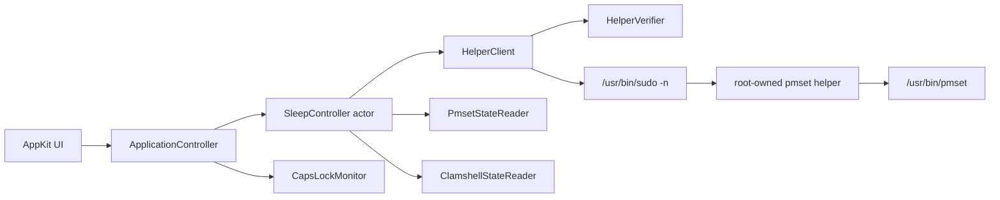

# Capsomnia 製品・技術設計

更新日: 2026-07-15
状態: 本人利用版 Phase 0〜3 完成・実機検証済み、配布版 Phase 4〜6 未実施

## 1. 目的

Caps Lock キーを、Mac のシステムスリープを明示的に切り替える物理スイッチとして使う。
長時間のビルド、AI エージェント、SSH、ダウンロードなどを継続したいときに Caps Lock を
ON にし、終了後は OFF にするだけで通常の電源管理へ戻せることを目標とする。

最初の利用者はこのリポジトリ所有者本人である。初期リリースでは機能を広げず、動作の
予測可能性、権限の狭さ、復旧のしやすさ、配布物の検証可能性を優先する。

## 2. スコープ

### 2.1 v1 に含めるもの

- macOS 14 以降のメニューバー常駐アプリ
- Caps Lock 状態の 250 ms 間隔ポーリング
- Caps Lock ON: `pmset -a disablesleep 1`
- Caps Lock OFF: `pmset -a disablesleep 0`
- 実際の `SleepDisabled` 状態の直後確認と 10 秒間隔の再確認
- 失敗、状態不一致、helper 検証失敗を示す赤いステータス
- 5 秒間隔の再試行
- Caps Lock ON 中に蓋を閉じた場合、設定に応じて画面だけをスリープ
- アプリの正常終了時とアンインストール時に通常スリープへ復旧
- ログイン時起動、メニューバー表示、蓋閉じ時の画面スリープ、日本語・英語の設定
- Codex / Claude Codeのlocal lifecycle hookを使った任意のAgent Activity表示
- ローカルソースインストールとアンインストール
- Developer ID 署名、公証、Installer package を作れる配布パイプライン

### 2.2 v1 に含めないもの

- App Store 配布
- 自動アップデート
- ネットワーク通信、クラッシュ送信、テレメトリ、アカウント
- キーボードイベントの取得、Input Monitoring 権限
- 任意コマンド実行、任意の `pmset` 引数
- 複数ユーザーが同時ログインした状態の協調制御
- 元の `fuji-mak/Capsomnia` と同時に動作させること
- バッテリー残量による自動停止、時間制限、スケジュール機能
- Web サイトやマーケティングページ

## 3. 固定する製品識別子

| 項目 | 値 |
|---|---|
| アプリ名 | `Capsomnia` |
| リポジトリ | `oonishidaichi/capsomnia` |
| Bundle ID / LaunchAgent label | `com.github.oonishidaichi.capsomnia` |
| helper signing identifier | `com.github.oonishidaichi.capsomnia.pmset-helper` |
| helper path | `/Library/PrivilegedHelperTools/com.github.oonishidaichi.capsomnia.pmset-helper` |
| sudoers path | `/etc/sudoers.d/capsomnia_oonishidaichi` |
| system LaunchAgent | `/Library/LaunchAgents/com.github.oonishidaichi.capsomnia.plist` |
| app path (package版) | `/Applications/Capsomnia.app` |
| app path (source版) | `~/Applications/Capsomnia.app` |
| log path | `~/Library/Logs/Capsomnia/capsomnia.log` |
| preferences domain | `com.github.oonishidaichi.capsomnia` |

`resources/Info.plist` の Bundle ID を製品識別子の正本とする。シェルスクリプトはそこから
値を読み、helper ID と各パスを規則的に導出する。Swift 側は起動時に `Bundle.main` から
読み、テスト時は `ProductIdentity` を注入する。識別子の手書き複製はテストで検出する。

同じ Info.plist に `CapsomniaBuildFlavor` を持たせ、値は `development` または `release` の
完全一致だけを許可する。`build-app.sh` は app bundle を組み立てた後、署名前にこの値を設定する。
ローカル source install は `development`、Developer ID 配布は `release` とする。不明な値では
helper を実行しない。

## 4. ユーザー体験

### 4.1 通常動作

1. アプリ起動時に Caps Lock の現在値を読む。
2. ON ならスリープ抑止、OFF なら通常スリープを要求する。
3. helper 実行後に `pmset -g` を読み、実際の状態が一致してから成功表示にする。
4. 以後は Caps Lock の変化を最大約 250 ms で検知して同期する。
5. 状態が変わらなくても 10 秒ごとに drift を検査する。

### 4.2 ステータス表示

| 表示 | 意味 |
|---|---|
| 緑 | Caps Lock ON かつ `SleepDisabled=1` を確認済み |
| グレー | Caps Lock OFF かつ `SleepDisabled=0` を確認済み |
| 赤 | helper、署名・所有権、`pmset` 読み取り、または状態一致のいずれかに失敗 |

設定でメニューバーアイコンを隠していても、エラー中は赤いアイコンを一時表示する。
ツールチップには短い状態と復旧の方向だけを出し、コマンドや内部実装は表示しない。

### 4.3 初回起動

初回画面では次を短く明示する。

- Caps Lock ON は Mac をスリープさせないこと
- 蓋を閉じた運用では発熱とバッテリー消費が増えること
- Caps Lock OFF またはアプリ終了で通常状態へ戻ること
- helper が正しく入っていない場合は動作せず、赤表示になること

設定の初期値は次の通り。

| 設定 | 初期値 |
|---|---|
| メニューバーアイコン | ON |
| ログイン時に起動 | ON |
| 蓋を閉じたら画面をスリープ | ON |
| 言語 | OS が日本語なら日本語、それ以外は英語 |
| Agent Activity | OFF |

### 4.4 エラー体験

エラー時に成功状態を装わない。メニューバーは赤、設定画面には次のいずれかを表示する。

- helper が未インストール
- helper の所有者または権限が不正
- helper の署名または identifier が不正
- sudoers が利用できず helper を実行できない
- `pmset` の状態を確認できない
- 要求状態と実際の状態が一致しない

「再試行」は即時同期を一回だけ要求する。「修復」は v1 では設定画面から root 操作を
行わず、再インストール手順を案内する。

## 5. アーキテクチャ

### 5.1 技術選定

- Swift 6 toolchain、Swift language mode 5
- Swift Package Manager
- AppKit
- Foundation、CoreGraphics、IOKit、Security の Apple framework のみ
- 外部 Swift package 依存なし
- シェルは zsh、`set -euo pipefail`、macOS 標準コマンドのみ

AppKit を選ぶ理由は、既存実装との親和性、`NSStatusItem` とアプリ lifecycle の明快さ、
小規模メニューバーアプリで SwiftUI/AppKit の二重管理を避けるためである。

### 5.2 SwiftPM target

```text
CapsomniaCore                 純粋な状態遷移、protocol、parser、設定モデル
CapsomniaAgentCore            agent eventの最小化、状態store、hook設定merge
Capsomnia                     AppKit UI と macOS API adapter、composition root
CapsomniaAgentReporter        Codex / Claude hookから状態fileを更新するexecutable
CapsomniaPmsetHelperCore      helper の引数解析と固定 pmset command mapping
CapsomniaPmsetHelper          root で動く最小 executable
CapsomniaCoreTests            状態遷移と parser のテスト
CapsomniaPmsetHelperTests     helper command mapping のテスト
CapsomniaIntegrationTests     fake process/helper を使う統合テスト
CapsomniaAgentCoreTests       event mapping、privacy、hook mergeのテスト
```

UI や `Process` を直接テストするのではなく、Core に時刻、Caps Lock、実状態、helper 結果を
入力し、出力される action と表示状態を検証する。

### 5.3 推奨ディレクトリ

```text
Package.swift
LICENSE
NOTICE.md
README.md
resources/
  Info.plist
  AppIcon.icns
Sources/
  CapsomniaCore/
    ProductIdentity.swift
    SleepController.swift
    SleepControllerState.swift
    SleepStateParser.swift
    ServiceProtocols.swift
  Capsomnia/
    main.swift
    ApplicationController.swift
    AppConstants.swift
    Services/
      CapsLockMonitor.swift
      ClamshellStateReader.swift
      HelperClient.swift
      HelperVerifier.swift
      LaunchAgentManager.swift
      PmsetStateReader.swift
      ProcessRunner.swift
    UI/
      StatusItemController.swift
      SettingsWindowController.swift
  CapsomniaAgentCore/
    AgentActivity.swift
    AgentActivityStore.swift
    AgentEventMapper.swift
    AgentHookConfigurationManager.swift
  CapsomniaAgentReporter/
    main.swift
  CapsomniaPmsetHelperCore/
    HelperCommand.swift
  CapsomniaPmsetHelper/
    main.swift
Tests/
  CapsomniaCoreTests/
  CapsomniaPmsetHelperTests/
  CapsomniaIntegrationTests/
  CapsomniaAgentCoreTests/
scripts/
  build-app.sh
  build-pkg.sh
  install-local.sh
  uninstall.sh
  notarize-pkg.sh
  verify-artifacts.sh
```

### 5.4 依存関係



`CapsomniaCore` は AppKit、CoreGraphics、IOKit、Security、`Process` に依存しない。
macOS 固有処理は protocol の adapter として `Capsomnia` target に置く。

## 6. 並行処理と状態管理

### 6.1 実行モデル

- UI と `NSStatusItem` 更新は `@MainActor` の `ApplicationController` が担当する。
- 状態遷移は `SleepController` actor が直列化する。
- `Process` 実行はメインスレッドを塞がない `ProcessRunner` actor で行う。
- Caps Lock monitor は 250 ms interval、50 ms tolerance の timer で変化だけを通知する。
- helper 呼び出しは同時に一つまで。古い結果が新しい desired state を上書きしないよう、
  各同期要求に単調増加する generation を付ける。

### 6.2 状態

```text
stopped
synchronizing(desired, generation)
verified(desired, verifiedAt)
degraded(desired, error, retryAt)
```

`desired` は `normalSleep` または `preventSleep`。表示上の ON/OFF は要求値ではなく、必ず
確認済みの実状態から決める。確認できないときは `degraded` とする。

### 6.3 イベントと規則

| イベント | 規則 |
|---|---|
| 起動 | Caps Lock を読み、無条件で同期する |
| Caps Lock 変化 | generation を増やし、直ちに新しい desired を適用する |
| helper 成功 | `pmset -g` で一致を確認してから verified にする |
| helper 失敗 | degraded、5 秒後に再試行 |
| 状態読取失敗 | degraded、5 秒後に再試行 |
| 10 秒検査 | drift なら helper を再実行し、再確認する |
| 蓋を閉じた | desired が prevent かつ設定 ON のとき display-sleep を一度だけ実行 |
| 蓋を開けた | display-sleep 実行済みフラグを解除する |
| 正常終了 | 同期的に `off` を一度実行し、結果をログに残す |
| 異常終了 | LaunchAgent が再起動し、起動時同期で復旧を試みる |

アプリがクラッシュした瞬間に必ず通常スリープへ戻すことは、sudoers helper 方式だけでは
保証できない。この残余リスクは UI と README に明示する。root daemon/watchdog は v1 の
権限面と複雑性を増やすため採用しない。

## 7. system service adapter

### 7.1 Caps Lock

`CGEventSource.flagsState(.hidSystemState).contains(.maskAlphaShift)` のみを読む。イベント tap、
キーコード、入力内容、修飾キー履歴を取得しない。Accessibility と Input Monitoring を
要求しない。

### 7.2 `pmset` 状態読取

一般ユーザー権限で `/usr/bin/pmset -g` を実行し、行を空白分割して `SleepDisabled 0|1`
だけを受理する。欠落、重複、0/1 以外は unknown とする。locale 依存の文章は解析しない。

### 7.3 clamshell

IORegistry の `IOPMrootDomain` から `AppleClamshellState` を読む。取得不能は false とみなさず
unknown とし、画面スリープ要求を行わない。

### 7.4 helper client

helper を呼ぶたびに、直前に `HelperVerifier` を通す。検証 cache は持たない。検証後、次の
形式でのみ実行する。

```text
/usr/bin/sudo -n <fixed-helper-path> on
/usr/bin/sudo -n <fixed-helper-path> off
/usr/bin/sudo -n <fixed-helper-path> display-sleep
```

shell、`env`、PATH 検索、ユーザー入力、文字列連結コマンドは使わない。

## 8. helper

helper は一つの引数だけを受け付ける。対応は次で固定する。

| helper 引数 | executable | arguments |
|---|---|---|
| `on` | `/usr/bin/pmset` | `-a disablesleep 1` |
| `off` | `/usr/bin/pmset` | `-a disablesleep 0` |
| `display-sleep` | `/usr/bin/pmset` | `displaysleepnow` |

それ以外、引数なし、複数引数は `EX_USAGE` (64)。`Process` 起動不能は `EX_SOFTWARE` (70)。
`pmset` の終了コードはそのまま返す。標準入力を読まず、ネットワーク、ファイル書き込み、
shell 起動、環境変数による executable 変更を行わない。

## 9. ログ

ログはローカルファイルのみ。各行を ISO 8601 timestamp と key-value 形式にする。

記録するもの:

- lifecycle、設定変更、Caps Lock の状態変化
- helper の mode、終了コード、短く制限した stderr
- verification 成否、drift、再試行
- helper verifier の失敗カテゴリ

記録しないもの:

- キー入力、ファイル名、ユーザー文書、環境変数
- username、home path、端末名、IP アドレス
- sudo パスワードや認証情報

1ファイル 1 MiB を超えたら `.1` へ一世代だけ rotation する。各 stdout/stderr は 2 KiB で
打ち切り、制御文字を除去する。

## 10. インストールと共存

v1 は single active console user を対象とする。インストーラは対象ユーザー名を厳格に検証し、
そのユーザーだけに sudoers rule を作る。

`/Applications/Capsomnia.app` が存在する場合、Bundle ID が本製品と一致すれば upgrade、
異なればインストールを中止する。元の `fuji-mak` helper、sudoers、LaunchAgent が存在する
場合も、自動削除せず中止してアンインストールを案内する。二つのアプリが同じ global
`pmset` 状態を競合更新するのを避けるためである。

## 11. 配布戦略

### 11.1 Phase A: 個人利用版

- 現在の Mac の architecture 向け release build
- app と helper を ad hoc sign
- source installer が `~/Applications`、root-owned helper、sudoers、user LaunchAgent を配置
- 実機 smoke test に合格した時点で本人利用可

### 11.2 Phase B: 第三者配布版

- Developer ID Application で app と helper を個別に署名
- helper には明示的な signing identifier を指定
- `pkgbuild --ownership recommended` で payload を一度だけ生成
- Developer ID Installer で package を署名
- Apple notarization と staple
- versioned pkg、stable pkg、`SHA256SUMS.txt` を公開

最重要制約: app/helper を署名した後、payload を `pkgutil --expand-full`、`cpio`、`xattr -c`
などで書き換えない。所有者は `pkgbuild` の標準 `--ownership recommended` を使い、
パッケージ生成後の再梱包は行わない。

## 12. 設計上の判断

### sudoers helper を v1 で採用する理由

SMAppService/LaunchDaemon/XPC は将来的な選択肢だが、正しい code-signing requirement、更新、
daemon lifecycle、通信認証まで含めると v1 の監査面積が大きくなる。本製品の root 操作は
3つの固定 `pmset` command だけなので、root-owned helper、厳密な引数、digest 付き sudoers、
実行前検証の組み合わせを v1 の最小権限境界とする。

### fork ではなく独立 namespace にする理由

表示名は同じでも、helper と sudoers は root 権限を扱う。upstream と同じ path/identifier を
使うと、一方の更新が他方の信頼境界を書き換える。したがって root 関連識別子はすべて
`com.github.oonishidaichi.capsomnia` 配下へ分離する。
